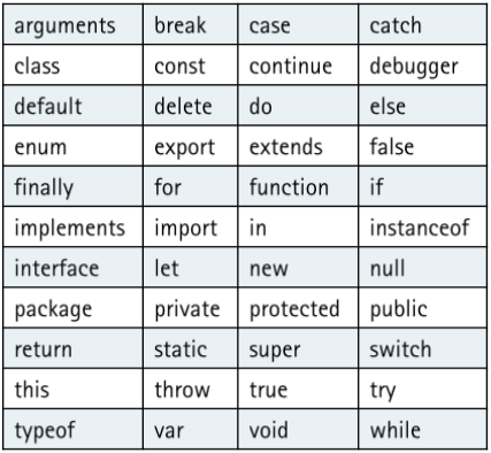
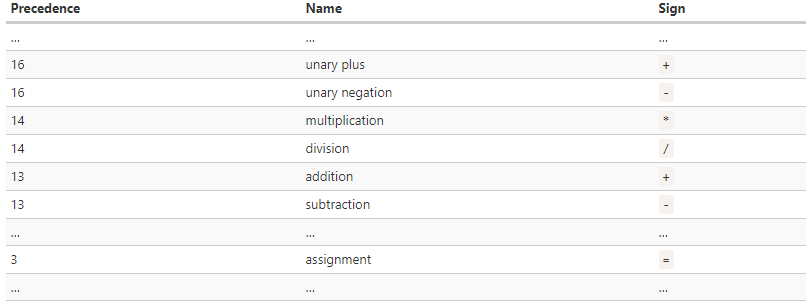

What are variables in JavaScript?
--------------------------------

Variables are useful to store values and use them on different parts of your code.

You can place data into these variables and then refer to the data simply by naming the variable.

There are three keywords used when declaring variable in Javascript, namely: `var`,`let`,`const`
They follow this pattern or syntax `let variableName = variableValue`.

- Example:
```
let myName = 'Anthony';
let my_number = 25;
const PI = 3.14
var city = "Madrid"
```
How to declare variables?
-----------------------
As we said, we have three ways to declare variables: `var`,`let`,`const`. Let´s see how would work.

## Declare variables using let or var
```
var five = 5;
let six  = 6;
```

If you omit var or let you will get a global variable, which can lead to all sorts of problems. JUST DON'T DO IT!

`var` and `let` mean subtly different things, both having to do with [scope](https://stackoverflow.com/questions/762011/whats-the-difference-between-using-let-and-var-to-declare-a-variable). A good rule of thumb is to use `let` unless you are working with an older version of the JavaScript interpreter.

## Declare variables using const
You can declare a constant with the `const` operator. Constants are like variables declared with `let`, but cannot change their value through reassignment.

```
const FIVE = 5;
FIVE = 6;  // TypeError: Assignment to constant variable.
```

**Note** that each line of JavaScript code ends with the `;`. This is optional for the code to work (sometimes, and the rules are inconsistent) but **not** optional when taking into consideration style guidelines.

Naming variables Javascript
--------------------------------

To check the valid characters for JavaScript variable names, you should follow the below given naming conventions, which discuss about other rules to name a variable:

- Name can begin with `$` and `_` characters, for example, `_result`.
- You should not use any of the JavaScript reserved keywords as a variable name. For example, `break` or `boolean` variable names are not valid. Check the next table:



- JavaScript variable names should not start with a numeral `(0-9)`. They must begin with a letter or an underscore character. For example, `123test` is an invalid variable name but `_123test` is a valid one.

- JavaScript variable names are case-sensitive. For example, `Name` and`name` are two different variables.


Numeric operators in Javascript
--------------------------------

We know many numeric operators from school. They are things like addition `+`, multiplication `*,` subtraction `-`, and so on.

We'll concentrate on aspects of numeric operators used in Javascript.

Assignment in Javascript
--------------------------------
Let’s note that an assignment `=` is also an operator.

That’s why, when we assign a variable, like `x = 2 * 2 + 1`, the calculations are done first and then the `=` is evaluated, storing the result in `x`.

```
let x = 2 * 2 + 1;
alert( x ); // 5
```
It is possible to chain assignments:
```
let a, b, c;

a = b = c = 2 + 2;

alert( a ); // 4
alert( b ); // 4
alert( c ); // 4

```

Chained assignments evaluate from right to left. First, the rightmost expression `2 + 2` is evaluated and then assigned to the variables on the left: `c`, `b` and `a`. At the end, all the variables share a single value.

Remainder %
--------------------------------

The remainder operator `%`, despite its appearance, is not related to percents.

The result of `a % b` is the remainder of the integer division of `a` by `b`.

For instance:
```
alert( 5 % 2 ); // 1 is a remainder of 5 divided by 2
alert( 8 % 3 ); // 2 is a remainder of 8 divided by 3
alert( 6 % 3 ); // 0 is a remainder of 6 divided by 3
```

Exponentiation **
--------------------------------
The exponentiation operator `**` is a recent addition to the language.

For a natural number `b`, the result of `a ** b` is a multiplied by itself `b` times.

For instance:
```
alert( 2 ** 2 ); // 4  (2 * 2)
alert( 2 ** 3 ); // 8  (2 * 2 * 2)
alert( 2 ** 4 ); // 16 (2 * 2 * 2 * 2)
```

Increment/decrement
--------------------------------

Increasing or decreasing a number by one is among the most common numerical operations.

So, there are special operators for it:

- Increment `++` increases a variable by 1:
```
let counter = 2;
counter++;      // works the same as counter = counter + 1, but is shorter
alert( counter ); // 3
```
- `Decrement` -- decreases a variable by 1:
```
let counter = 2;
counter--;      // works the same as counter = counter - 1, but is shorter
alert( counter ); // 1
```

**Note** Increment/decrement can only be applied to variables. Trying to use it on a value like `5++` will give an error.

The operators `++` and `--` can be placed either before or after a variable.

When the operator goes after the variable, it is in "postfix form": `counter++`.
The "prefix form" is when the operator goes before the variable: `++counter`.
Both of these statements do the same thing: increase `counter` by `1`.


Operator precedence in Javascript
--------------------------------

If an expression has more than one operator, the execution order is defined by their precedence, or, in other words, the implicit priority order of operators.

From school, we all know that the multiplication in the expression `1 + 2 * 2` should be calculated before the addition. That’s exactly the precedence thing. The multiplication is said to have a higher precedence than the addition.

Parentheses override any precedence, so if we’re not satisfied with the implicit order, we can use them to change it. For example: `(1 + 2) * 2`.

There are many operators in JavaScript. Every operator has a corresponding precedence number. The one with the larger number executes first. If the precedence is the same, the execution order is from left to right.

 
Here’s an extract from the [precedence table](https://developer.mozilla.org/en-US/docs/Web/JavaScript/Reference/Operators/Operator_Precedence):

Esta tabla es confusa, tiene operadores complicados (suma unaria, negación), no he encontrado otra sencilla en Google. 
Así que deberíamos preparar otra




Introduction to dataypes in JavaScript
--------------------------------

A variable in JavaScript can contain any data. 

JavaScript's basic types are: `Boolean`, `Null`,`Undefined`, `Number`, `String`, `Array`, `Object`, and `Function`.

`**Boolean**` is `**true**` or `**false**`

```
let t = true;
let f = false;
```

**`Null` is the value null. This represents an "empty" value**.
```
let empty = null;
```
**`Undefined` is the value undefined**.
When a variable which has not declared is accessed, JS returns undefined.
```
let u;
console.log(u); //-> undefined
```

**`Number` is a numeric value**
It includes integers (1, 2, 3, etc.), floats (1.4, -40.1), infinity (+Infinity, -Infinity), and `NaN` which means "not a number." `NaN` is returned when you do a numeric operation on anything that's not a `Number`.
```
let four = 4,     // Note the comma-separated variable declarations
    two = 2.0;

Infinity < Number.MAX_VALUE  // false
Infinity > Number.MAX_VALUE  // true

two == four / two; // true

// All JS numbers are floats, and floats are not 100% accurate...
0.1 + 0.2 == 0.3; // false!
0.1 + 0.2;

'asdf' - 5; // NaN
```
**`Strings` are declared with `""` or `''` or use backticks `` .**
The first two are the same. Pick one and stick with it!

Using backticks will allow you to do string interpolation, but some browsers may not have implemented it yet.
```
let str = "This is a string";
str.length;      // 16 - access the length property
str.substr(2,5); // "is is" - call the substr function

let e = "elephant";
console.log("${e} hotdog"); // "${e} hotdog" js doesn't do interpolation with ""
console.log(`${e} hotdog`);  // `elephant hotdog`
```

**Note** We will standardize on using single quotes ' ' for strings, except in cases of string interpolation (where backticks are required).

**Arrays**
They are declared and accessed with square brackets `([])`.
```
let arr = [1, 2, 3, 4];
arr.length;  // 4 - access the length property
             // Note this *cannot* be accessed like a method with parentheses
arr[0];      // 1
arr.pop()    // 4 - call the pop() function
             // Note this method *cannot* be used without the parentheses
arr;         // [1, 2, 3]; pop() mutates the array
```
**Objects**
They are declared with braces`({})`. You can access properties in an Object with bracket notation (like an array) or dot notation.

```
let obj = {     // We can span lines; whitespace is mostly ignored.
  num: 5,
  str: 'This is a string',
  subObject: {
    otherNum: 4
  }
};

obj.num;    // 5
obj['num']; // 5; note we use a string!
obj.subObject.otherNum; // 4
obj.foo;    // undefined
```

[More info about data types](https://developer.mozilla.org/en-US/docs/Web/JavaScript/Data_structures)